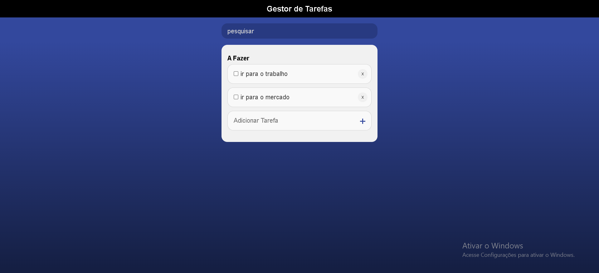

# GestorDeTarefas

Sistema de gestão de tarefas desenvolvido em angular, conta com função de adicionar, excluir, marcar como concluida e editar tarefas,e ao clicar na tarefa pode-se adicionar detalhes ou editar detalhes

<a href="https://gestao-de-tarefas-rafael.web.app">Clique aqui para acessar</a>

